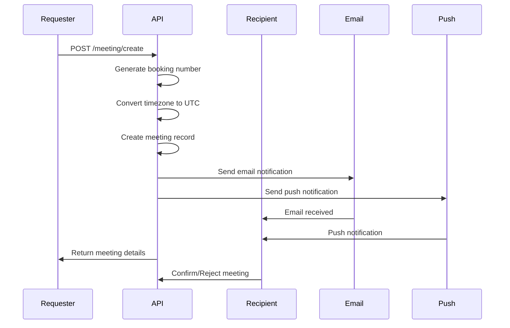

## Overview

Create a meeting request with another user. The recipient receives an email notification and push notification (if using mobile app) to confirm or reject the meeting. Meetings are automatically set for 1 hour duration.

## Request Body

<ParamField body="user_id" type="integer" required>
  The ID of the user to request a meeting with (recipient/client).
  
  **Example:** `5`
</ParamField>

<ParamField body="team_id" type="integer" required>
  The ID of the team this meeting belongs to.
  
  **Example:** `1`
</ParamField>

<ParamField body="date" type="string" required>
  The proposed date and time for the meeting. The time will be converted from the recipient's timezone to UTC.
  
  **Format:** Any valid date-time string that can be parsed
  
  **Example:** `"2025-12-15 14:00:00"`, `"2025-12-15T14:00:00"`
</ParamField>

<ParamField body="link" type="string">
  Optional meeting link (e.g., Zoom, Google Meet, Microsoft Teams URL).
  
  **Example:** `"https://zoom.us/j/1234567890"`
</ParamField>

## Response

<ResponseField name="id" type="integer">
  The unique identifier of the meeting booking.
</ResponseField>

<ResponseField name="booking_number" type="string">
  Unique booking reference number for the meeting.
</ResponseField>

<ResponseField name="client_id" type="integer">
  The ID of the user the meeting is with (recipient).
</ResponseField>

<ResponseField name="user_id" type="integer">
  The ID of the user who created the meeting request.
</ResponseField>

<ResponseField name="team_id" type="integer">
  The ID of the team this meeting belongs to.
</ResponseField>

<ResponseField name="timezone" type="string">
  The timezone of the recipient user.
</ResponseField>

<ResponseField name="booking_date" type="string">
  The meeting date and time in UTC.
</ResponseField>

<ResponseField name="start_time" type="integer">
  Unix timestamp for the meeting start time.
</ResponseField>

<ResponseField name="end_time" type="integer">
  Unix timestamp for the meeting end time (1 hour after start).
</ResponseField>

<ResponseField name="created_at" type="string">
  The timestamp when the meeting was created (ISO 8601 format).
</ResponseField>

<ResponseField name="updated_at" type="string">
  The timestamp when the meeting was last updated (ISO 8601 format).
</ResponseField>

## Example Request
```bash
curl --request POST \
  --url https://staging.thareja.org/api/v3/meeting/create \
  --header 'Authorization: Bearer YOUR_API_TOKEN' \
  --header 'Content-Type: application/json' \
  --data '{
    "user_id": 5,
    "team_id": 1,
    "date": "2025-12-15 14:00:00",
    "link": "https://zoom.us/j/1234567890"
  }'
```

## Example Request (JavaScript)
```javascript
fetch('https://staging.thareja.org/api/v3/meeting/create', {
  method: 'POST',
  headers: {
    'Authorization': 'Bearer YOUR_API_TOKEN',
    'Content-Type': 'application/json'
  },
  body: JSON.stringify({
    user_id: 5,
    team_id: 1,
    date: "2025-12-15 14:00:00",
    link: "https://zoom.us/j/1234567890"
  })
})
.then(response => response.json())
.then(data => console.log(data));
```

## Example Response
```json
{
  "id": 123,
  "booking_number": "MTG-20251128-001",
  "client_id": 5,
  "user_id": 1,
  "team_id": 1,
  "timezone": "America/New_York",
  "booking_date": "2025-12-15 19:00:00",
  "start_time": 1734289200,
  "end_time": 1734292800,
  "created_at": "2025-11-28T10:30:00Z",
  "updated_at": "2025-11-28T10:30:00Z"
}
```

## Example Request - Without Meeting Link
```bash
curl --request POST \
  --url https://staging.thareja.org/api/v3/meeting/create \
  --header 'Authorization: Bearer YOUR_API_TOKEN' \
  --header 'Content-Type: application/json' \
  --data '{
    "user_id": 5,
    "team_id": 1,
    "date": "2025-12-15T14:00:00"
  }'
```

## Error Responses

<ResponseExample>
```json 400 Bad Request - Missing Required Fields
{
  "error": 400,
  "message": "user_id, team_id, and date are required"
}
```
```json 401 Unauthorized
{
  "error": 401,
  "message": "Invalid or missing authentication token"
}
```
```json 404 Not Found - User Not Found
{
  "error": 404,
  "message": "User with ID 5 does not exist"
}
```
```json 400 Bad Request - Invalid Date
{
  "error": 400,
  "message": "Invalid date format"
}
```
```json 400 Bad Request - Past Date
{
  "error": 400,
  "message": "Meeting date cannot be in the past"
}
```
</ResponseExample>

## Automatic Notifications

When a meeting is created, the recipient receives:

### Email Notification
- **Subject**: "You have received new meeting request!"
- **Content**: Includes requester name, date/time in UTC, and link to view pending meetings
- **Action Link**: Takes user to pending meetings page
- **Meeting Link**: If provided, included in the email

### Push Notification (Mobile)
- **Title**: "MEETING ALERT"
- **Message**: "[Your Name] requested a meeting with you. Click to Confirm or Reject."
- **Action**: Opens meeting screen in mobile app
- **Type**: `meeting-created`

## Meeting Details

### Duration
- **Default duration**: 1 hour (3600 seconds)
- Automatically calculated: `end_time = start_time + 3600`

### Timezone Handling
1. Date is provided in any format
2. Converted to recipient's timezone
3. Then converted to UTC for storage
4. If recipient's timezone is invalid, defaults to UTC

### Booking Number
- Automatically generated unique identifier
- Format: Custom booking ID (implementation-specific)
- Used for reference and tracking

## Meeting Workflow


## Status Flow

1. **Created**: Meeting request is created (pending)
2. **Pending**: Waiting for recipient confirmation
3. **Confirmed**: Recipient accepted the meeting
4. **Rejected**: Recipient declined the meeting
5. **Completed**: Meeting has taken place

## Notes

- **Timezone conversion**: Meeting times are automatically converted from recipient's timezone to UTC
- **1-hour duration**: All meetings are automatically set for 1 hour
- **Booking number**: A unique booking reference is generated for each meeting
- **Email notification**: Recipient receives email with meeting details and action link
- **Push notification**: If recipient has mobile app, they receive real-time push notification
- **Meeting link**: Optional meeting link (Zoom, Google Meet, etc.) can be included
- **Pending status**: Meetings are created in pending status awaiting recipient action
- **Action URL**: Email includes link to `/meetings?tab=pending-meeting`
- **Invalid timezone**: If recipient's timezone is invalid, defaults to UTC

## Best Practices

- Always provide a meeting link for virtual meetings
- Choose appropriate times considering recipient's timezone
- Include meeting purpose in follow-up communication
- Send calendar invites separately if needed
- Confirm meeting details before the scheduled time
- Allow sufficient buffer time between meetings

## Use Cases

- **One-on-one meetings**: Schedule meetings with team members
- **Client consultations**: Book time with clients
- **Review sessions**: Schedule performance reviews or project reviews
- **Training sessions**: Set up training or onboarding meetings
- **Quick calls**: Schedule brief sync-up calls

## Related Endpoints

- [Get Pending Meetings](/api-reference/meeting/pending) - List pending meeting requests
- [Confirm Meeting](/api-reference/meeting/confirm) - Accept a meeting request
- [Reject Meeting](/api-reference/meeting/reject) - Decline a meeting request
- [Get Meeting Details](/api-reference/meeting/get) - Retrieve meeting information
- [Cancel Meeting](/api-reference/meeting/cancel) - Cancel a scheduled meeting
- [List User Meetings](/api-reference/meeting/list) - Get all meetings for a user