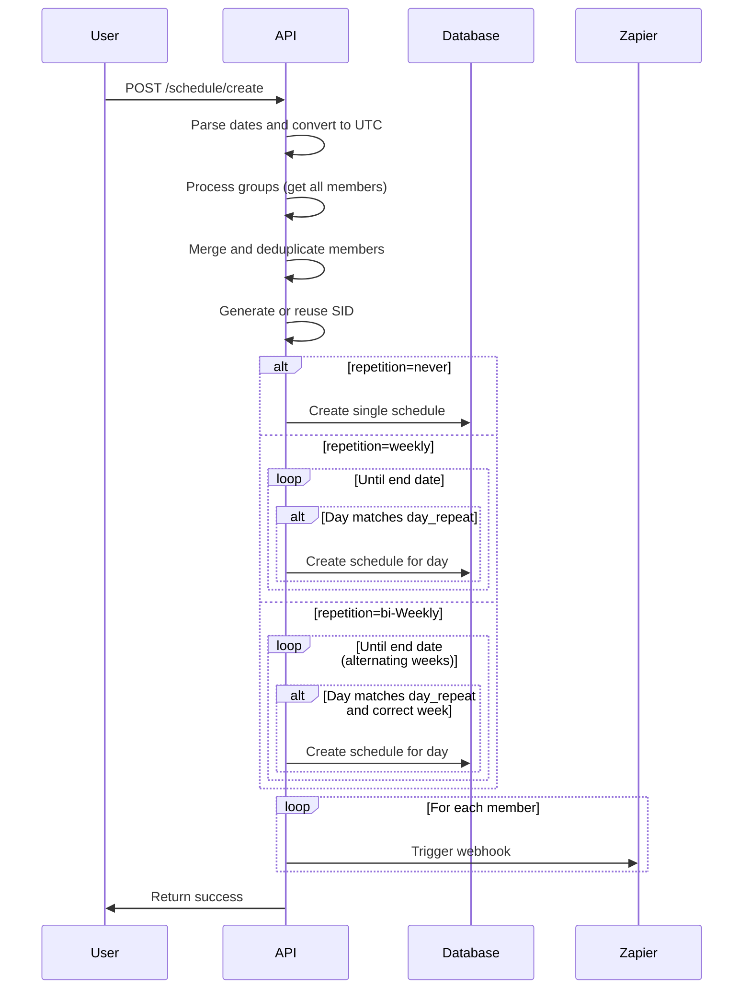

## Overview

Create work schedules for team members. Schedules can be one-time events or recurring (weekly or bi-weekly). You can assign schedules to individual members or entire groups, with automatic timezone conversion to UTC.

## Request Body

<ParamField body="date_from" type="string" required>
  Start date and time for the schedule. Will be converted to UTC.
  
  **Format:** Any valid date-time string
  
  **Example:** `"Mon Dec 15 2025 14:00:00 GMT-0800 (PST)"`
</ParamField>

<ParamField body="time_from" type="string" required>
  Start time for the schedule (HH:MM format, 24-hour).
  
  **Example:** `"09:00"`
</ParamField>

<ParamField body="time_to" type="string" required>
  End time for the schedule (HH:MM format, 24-hour).
  
  **Example:** `"17:00"`
</ParamField>

<ParamField body="timezone" type="string" required>
  Timezone for the schedule. Times will be converted from this timezone to UTC.
  
  **Example:** `"America/New_York"`, `"Europe/London"`
</ParamField>

<ParamField body="minimum_hours" type="number" required>
  Minimum hours for this schedule shift.
  
  **Example:** `8.0`
</ParamField>

<ParamField body="repetition" type="string" required>
  How the schedule repeats.
  
  **Allowed values:** `"never"`, `"weekly"`, `"bi-Weekly"`
  
  **Example:** `"weekly"`
</ParamField>

<ParamField body="members" type="string">
  Comma-separated list of user IDs to assign the schedule to.
  
  **Example:** `"1,5,7,9"`
</ParamField>

<ParamField body="groupsId" type="string">
  Comma-separated list of group IDs. All members and managers of these groups will be included.
  
  **Example:** `"2,3"`
</ParamField>

<ParamField body="day_repeat" type="string">
  Comma-separated list of days when the schedule repeats. Required for weekly/bi-weekly repetition.
  
  **Allowed values:** `mon`, `tue`, `wed`, `thu`, `fri`, `sat`, `sun`
  
  **Example:** `"mon,wed,fri"`
</ParamField>

<ParamField body="until" type="string">
  End date for recurring schedules. Required for weekly/bi-weekly repetition.
  
  **Format:** Same as date_from
  
  **Example:** `"Fri Dec 31 2025 17:00:00 GMT-0800 (PST)"`
</ParamField>

## Response

<ResponseField name="success" type="string">
  Success message confirming the schedule was created.
</ResponseField>

## Example Request - One-Time Schedule
```bash
curl --request POST \
  --url https://staging.thareja.org/api/v3/schedule/create \
  --header 'Authorization: Bearer YOUR_API_TOKEN' \
  --header 'Content-Type: application/json' \
  --data '{
    "date_from": "Mon Dec 15 2025 14:00:00 GMT-0800 (PST)",
    "time_from": "09:00",
    "time_to": "17:00",
    "timezone": "America/Los_Angeles",
    "minimum_hours": 8.0,
    "repetition": "never",
    "members": "1,5,7"
  }'
```

## Example Request - Weekly Recurring Schedule
```bash
curl --request POST \
  --url https://staging.thareja.org/api/v3/schedule/create \
  --header 'Authorization: Bearer YOUR_API_TOKEN' \
  --header 'Content-Type: application/json' \
  --data '{
    "date_from": "Mon Dec 15 2025 09:00:00 GMT-0800 (PST)",
    "time_from": "09:00",
    "time_to": "17:00",
    "timezone": "America/New_York",
    "minimum_hours": 8.0,
    "repetition": "weekly",
    "day_repeat": "mon,wed,fri",
    "until": "Fri Dec 31 2025 17:00:00 GMT-0800 (PST)",
    "members": "5,7,9"
  }'
```

## Example Request - Bi-Weekly with Groups
```bash
curl --request POST \
  --url https://staging.thareja.org/api/v3/schedule/create \
  --header 'Authorization: Bearer YOUR_API_TOKEN' \
  --header 'Content-Type: application/json' \
  --data '{
    "date_from": "Mon Dec 15 2025 09:00:00 GMT-0500 (EST)",
    "time_from": "09:00",
    "time_to": "17:00",
    "timezone": "America/New_York",
    "minimum_hours": 8.0,
    "repetition": "bi-Weekly",
    "day_repeat": "mon,tue,wed,thu,fri",
    "until": "Fri Mar 31 2026 17:00:00 GMT-0500 (EST)",
    "groupsId": "2,3",
    "members": "1"
  }'
```

## Example Request (JavaScript)
```javascript
fetch('https://staging.thareja.org/api/v3/schedule/create', {
  method: 'POST',
  headers: {
    'Authorization': 'Bearer YOUR_API_TOKEN',
    'Content-Type': 'application/json'
  },
  body: JSON.stringify({
    date_from: "Mon Dec 15 2025 09:00:00 GMT-0800 (PST)",
    time_from: "09:00",
    time_to: "17:00",
    timezone: "America/Los_Angeles",
    minimum_hours: 8.0,
    repetition: "weekly",
    day_repeat: "mon,wed,fri",
    until: "Fri Dec 31 2025 17:00:00 GMT-0800 (PST)",
    members: "5,7,9"
  })
})
.then(response => response.json())
.then(data => console.log(data));
```

## Example Response
```json
{
  "success": "data added successfully"
}
```

## Error Responses

<ResponseExample>
```json 400 Bad Request - Missing Required Fields
{
  "error": 400,
  "message": "date_from, time_from, time_to, timezone, minimum_hours, and repetition are required"
}
```
```json 400 Bad Request - Invalid Repetition
{
  "error": 400,
  "message": "day_repeat and until are required for weekly/bi-weekly repetition"
}
```
```json 400 Bad Request - Invalid Timezone
{
  "error": 400,
  "message": "Invalid timezone provided"
}
```
```json 400 Bad Request - Invalid Date
{
  "error": 400,
  "message": "Invalid date format"
}
```
```json 401 Unauthorized
{
  "error": 401,
  "message": "Invalid or missing authentication token"
}
```
```json 404 Not Found - Group Not Found
{
  "error": 404,
  "message": "One or more groups not found"
}
```
</ResponseExample>

## Repetition Types

### Never (One-Time)
Creates a single schedule entry for the specified date and time.

**Required fields:**
- `date_from`, `time_from`, `time_to`, `timezone`, `minimum_hours`, `repetition`

**Optional fields:**
- `members`, `groupsId`

### Weekly
Creates recurring schedules every week on specified days until the end date.

**Required fields:**
- All "Never" fields plus `day_repeat` and `until`

**Example:** Schedule every Monday, Wednesday, Friday from Dec 15 to Dec 31

### Bi-Weekly
Creates recurring schedules every other week on specified days until the end date.

**Required fields:**
- All "Weekly" fields

**Behavior:** Alternates weeks based on the week number of the start date (even/odd)

**Example:** Schedule every Monday and Thursday on alternating weeks

## Day Repeat Format

Specify days as lowercase three-letter abbreviations, comma-separated:

| Day | Value |
|-----|-------|
| Monday | `mon` |
| Tuesday | `tue` |
| Wednesday | `wed` |
| Thursday | `thu` |
| Friday | `fri` |
| Saturday | `sat` |
| Sunday | `sun` |

**Examples:**
- Weekdays: `"mon,tue,wed,thu,fri"`
- Weekends: `"sat,sun"`
- MWF: `"mon,wed,fri"`

## Member Assignment

### Direct Members
Provide user IDs as comma-separated string:
```json
{
  "members": "1,5,7,9"
}
```

### Group Assignment
Provide group IDs and all members/managers are automatically included:
```json
{
  "groupsId": "2,3"
}
```

### Combined
You can specify both groups and individual members:
```json
{
  "groupsId": "2,3",
  "members": "1,15"
}
```

**Note:** Duplicate members are automatically removed.

## Schedule ID (SID)

Each schedule is assigned a unique Schedule ID (SID):
- **New schedules**: A random 10-character hash is generated
- **Existing schedules**: If a schedule with the same `date_from` and `date_to` exists, its SID is reused
- **Purpose**: Groups related schedule entries together

## Timezone Handling

1. **Input**: Dates provided in any timezone format
2. **Conversion**: Automatically converted to UTC for storage
3. **Storage**: All schedules stored in UTC
4. **Display**: Convert back to user's timezone when retrieving

**Example:**
- Input: `"Mon Dec 15 2025 09:00:00 GMT-0800 (PST)"`
- Stored: `"2025-12-15 17:00:00"` (UTC)

## Automatic Notifications

### Zapier Webhook
For each member assigned to the schedule, a webhook is triggered:
```json
{
  "event": "new_schedule",
  "payload": {
    "user_id": 5,
    "team_id": 1,
    "sid": "abc123def4",
    "title": "New shift created for John Doe",
    "hours": 8.0,
    "shift_start": "09:00:00",
    "shift_end": "17:00:00",
    "start_date": "2025-12-15 17:00:00",
    "end_date": "2025-12-31 17:00:00",
    "repetition": "weekly",
    "day_repeat": "mon,wed,fri",
    "retrieved_at": "2025-11-28 10:30:00"
  },
  "criteria": {
    "team_id": 1
  }
}
```

## Schedule Creation Flow


## Bi-Weekly Logic

Bi-weekly schedules alternate based on week numbers:
- If start date is in an **even week**: schedules created on even weeks
- If start date is in an **odd week**: schedules created on odd weeks

**Example:**
- Start: Week 50 (even) - December 15, 2025
- Creates schedules: Week 50, 52, 2, 4, etc.
- Skips: Week 51, 1, 3, 5, etc.

## Notes

- **UTC storage**: All times are converted to and stored in UTC
- **Multiple members**: Separate schedule entries created for each member
- **Group expansion**: Groups are expanded to include all members and managers
- **Duplicate prevention**: Duplicate member IDs are automatically removed
- **SID reuse**: Schedules with identical start/end times share the same SID
- **Minimum hours**: Rounded to 2 decimal places
- **Team assignment**: Automatically assigned to your current team
- **User tracking**: Your user ID is recorded as the creator
- **Webhook integration**: Zapier webhooks trigger for each assigned member
- **Date parsing**: Flexible date format parsing with timezone support

## Best Practices

- Always specify timezone explicitly
- Use 24-hour time format (HH:MM)
- Provide `until` date for recurring schedules
- Test with a single member before bulk assignment
- Verify timezone conversions for accuracy
- Use groups for easier team-wide scheduling
- Set realistic minimum hours
- Plan recurring schedules in advance
- Consider holidays when setting end dates

## Use Cases

- **Shift scheduling**: Create rotating work shifts for team members
- **Project timelines**: Schedule recurring project work sessions
- **Team availability**: Set regular availability windows
- **Resource planning**: Plan team member allocations
- **Coverage schedules**: Ensure continuous coverage with rotating schedules
- **Training sessions**: Schedule recurring training or meetings

## Related Endpoints

- [Get Schedules](/api-reference/schedule/list) - List all schedules
- [Get User Schedule](/api-reference/schedule/user) - Get schedules for specific user
- [Update Schedule](/api-reference/schedule/update) - Modify existing schedule
- [Delete Schedule](/api-reference/schedule/delete) - Remove schedule
- [Get Schedule by SID](/api-reference/schedule/sid) - Get all schedules with same SID